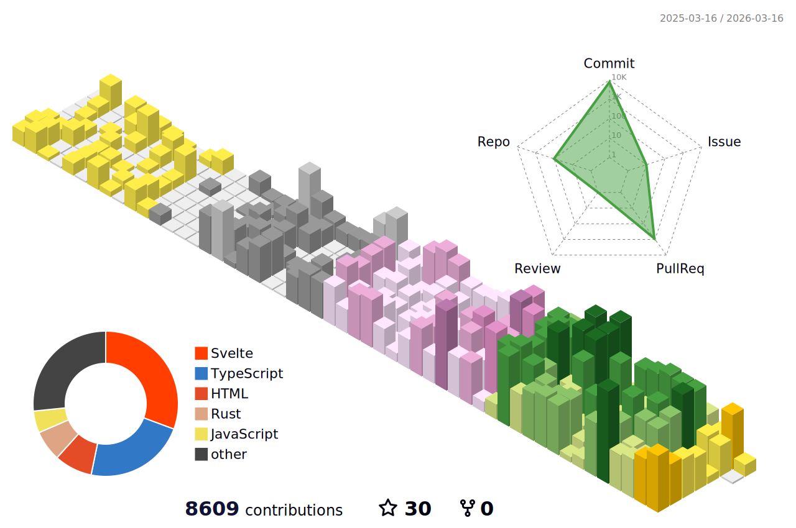

### 이력
2022 | Arisia.space ( 설립 )  
2023 | 대학교 발명경진대회 테크노밸리상  
2023 | 지능정보 시스템 응용 실험실 ( LAB )  
2023 | 동아리 회장  
2023 | Artsnoa.com ( artnoa TM ) 설립 ( Owner )  
2023 | 창업동아리  
2023 | 캡스톤( 객체인식 기반 사용자 모델 모델링 및 가상현실 메타버스 입력기 )  
2023 | DeepDynamic.me ( 딥다이나믹 ) 공동 설립  
2023 | 경기도 창업지원프로젝트 (우수상) 수상  
2023 | 대학교 발명경진대회 총장상  
2023 | 대학교 영어말하기 대회 장려상  
2023 | 대학교 로드맵 경진대회 우수상  
2023 | 대학교 특허 IP 경진대회 센터장상  
2024 | 군 복무 (24.5.13~)  
2025 | 마이픽오더 개발 (https://mypickorder.com)  
2025 | MakeDNS.net 개발 (https://makedns.net)  
2025 | 비공개 - 스토리지 엔진 개발  
2025 | RUST 기반 String-formatter 개발 (https://github.com/mirseo/string-formatter)  
2025 | 크롬 확장 프로그램 KoreaSelector 개발 (https://koreasel.mirseo.dev, https://github.com/mirseo/WhereIsKorea-Extensions)  
2025 | 머신러닝 알고리즘 교육용 프레젠테이션 디자인(C-2025-034244) 저작권등록     
2025 | RUST 기반 Nano-DRM 개발(디지털 워터마킹 라이브러리) (https://github.com/mirseo/nano-drm)   
2025 | Github(깃허브) 버전관리 교육용 프레젠테이션 디자인(C-2025-034423) 저작권 등록  
2025 | 크롬 확장 프로그램 KoreaSelector 게시 (https://chromewebstore.google.com/detail/koreaselector/oihlnoclkmpgodngpdlgiedhgoegmmoh)  
2025 | Proxmox LXC 환경에서 TAILSCALE 용 TUN을 활성화하는 스크립트 제작 (https://github.com/mirseo/proxmox-lxc-tailscale-injector)  
2025 | Rust 기반 SSH 브릿지, NotionSSH (2.0) 개발 (https://github.com/mirseo/notionSSH)  

## 이메일
aurora@artsnoa.com

## 공지
2025-09-12| 25년 9월 초에 발생한 대규모 NPM 공급망 침해 공격으로 제가 제작한 일부 레포지트리가 영향권에 있으며, 공격을 받았다는 정보를 식별했습니다. 관련 레포지트리의 경고 처리와 비활성 조치를 수행하였으며, 키 순환 예정입니다.  

