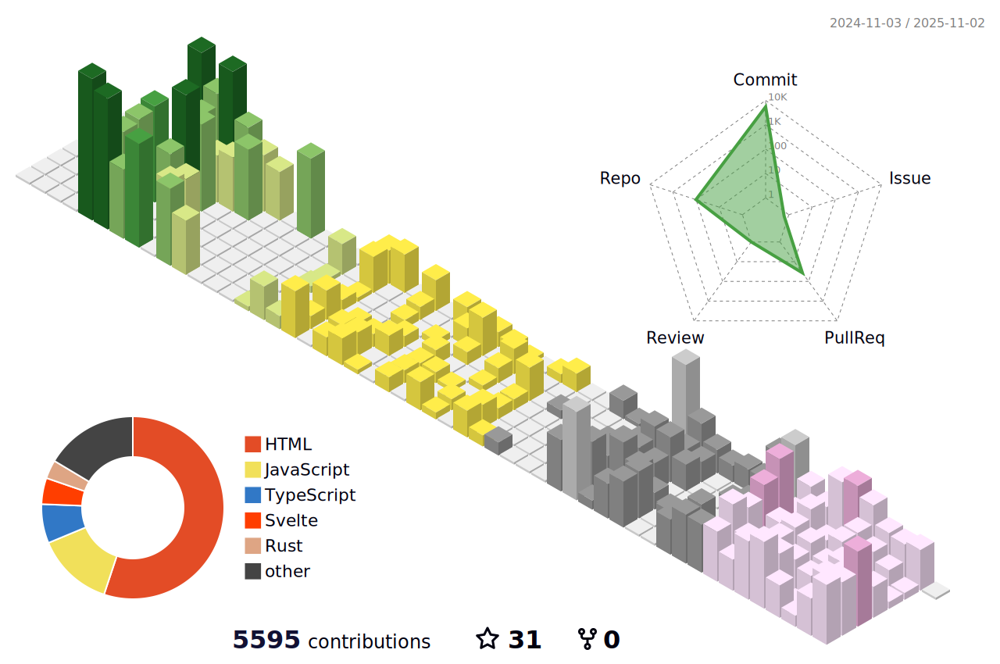

### Language
- [🇰🇷 한국어](README_ko.md)
- [🇺🇸 English](README.md)

### CliftonStrengths Top 5 ✦
| Rank | Theme | Type |
| :---: | :---: | :--- |
| 1 | Ideation | Strategic Thinking | 
| 2 | Strategic | Strategic Thinking | 
| 3 | Achiever | Execution | 
| 4 | Focus | Execution | 
| 5 | Deliberative | Execution |

### Career History
2019 | Naver Knowledge-iN Expert Activity (Top 0.0372% / Top 50,000 People)  
2022 | Founded Arisia.space  
2023 | University Invention Competition - Techno Valley Award  
2023 | Intelligent Information Systems Laboratory (LAB)  
2023 | Club President  
2023 | Founded Artsnoa.com (artsnoa TM) - Owner  
2023 | Startup Club  
2023 | Capstone Project (Object Recognition-based User Model Modeling and Virtual Reality Metaverse Input System)  
2023 | Co-founded DeepDynamic.me (Deep Dynamic)  
2023 | Gyeonggi-do Startup Support Project - Excellence Award  
2023 | University Invention Competition - President's Award  
2023 | University English Speaking Contest - Encouragement Award  
2023 | University Roadmap Competition - Excellence Award  
2023 | University Patent IP Competition - Center Director's Award  
2024 | Military Service (May 13, 2024~)  
2025 | [Military Service Achievement] Developed MyPickOrder (https://mypickorder.com)  
2025 | [Military Service Achievement] Developed MakeDNS.net (https://makedns.net)  
2025 | [Military Service Achievement] Confidential - Storage Engine Development  
2025 | [Military Service Achievement] Developed RUST-based String-formatter (https://github.com/mirseo/string-formatter)  
2025 | [Military Service Achievement] Developed Chrome Extension KoreaSelector (https://koreasel.mirseo.dev, https://github.com/mirseo/WhereIsKorea-Extensions)  
2025 | [Military Service Achievement] Copyright Registration for Machine Learning Algorithm Educational Presentation Design (C-2025-034244)  
2025 | [Military Service Achievement] Developed RUST-based Nano-DRM (Digital Watermarking Library) (https://github.com/mirseo/nano-drm)  
2025 | [Military Service Achievement] Copyright Registration for Github Version Control Educational Presentation Design (C-2025-034423)  
2025 | [Military Service Achievement] Published Chrome Extension KoreaSelector (https://chromewebstore.google.com/detail/koreaselector/oihlnoclkmpgodngpdlgiedhgoegmmoh)  
2025 | [Military Service Achievement] Created Script to Enable TUN for TAILSCALE in Proxmox LXC Environment (https://github.com/mirseo/proxmox-lxc-tailscale-injector)  
2025 | [Military Service Achievement] Developed Rust-based SSH Bridge, NotionSSH (2.0) (https://github.com/mirseo/notionSSH)  
2025 | [Military Service Achievement] Developed Docker Run to Compose Conversion Application Dockpose.com (https://dockpose.com)  
2025 | [Military Service Achievement] A dual-mode 8-bit CPU/ALU core built from scratch. v0.2 JSilicon - (https://github.com/mirseo/JSilicon)   
2025 | A 3MB file server written in Rust, supporting HTTP Range, Zero-Copy, and dynamic batch size transfers. (https://saibius.com)  
2025 | Turning imagination into reality, creating the official website for Artsnoa, a startup filled with my own memories. (https://artsnoa.com)  
2025 | usiaMCP is an MCP server that checks if a user's email address has been leaked on the dark web and provides step-by-step instructions for immediate remedial action. (https://playmcp.kakao.com/mcp/264)      
2025 | Saibius' Product Hunt officially launches and launches service. (https://www.producthunt.com/products/saibius)   
2026 | A utility to resolve Tailscale TPM recognition errors on Windows & Linux by resetting the TPM-bound state. (TTF)(https://github.com/mirseo/tailscale-tpm-fixer)  
2026 | SORI (Sori): Acquired copyright for digital idol goods display design (C-2026-001286)  
2026 | Intelligent Information Systems Laboratory (LAB) University Lab Director  
2026 | (MXSH) - A universal shell that eliminates operating system barriers through intelligent command translation and AI-powered security validation. (https://mxsh.net)  

## Email
aurora@artsnoa.com  
aurora@dockpose.com  
aurora@makedns.net  

## Announcements
2025-09-12 | Supply Chain Attack Mitigation Completed  
2025-09-28 | Reached 5,000 commits in the past year  
2025-10-03 | Fix Issue on Dockpose.com (Deploy CI/CD Error)  
2025-11-12 | Completion and discharge from military service  
2025-12-28 | December 29, 2025, 12:01 AM PST. Saibius.com is finally officially launched. Thank you :)  
2026-01-22 | Our self-developed CPU JSilicon (https://tinytapeout.com/chips/ttsky25b/tt_um_Jsilicon) is currently in production and is expected to arrive in June.  
2026-02-07 | Saibius v1.0.0.11 Update comming  
2026-02-12 | Saibius v1.0.0.11 Updated  

## Patent pending
1020250169883 | System and Method for Executing Heterogeneous OS Applications Using Edge-Based System Call Translation  
1020250162696 | Edge Computing-Based System and Method for Decentralized License Verification  
1020250135004 | Metaverse character implementation device  
1020230132111 | Secure IP camera access system and method using virtual private network and access token  
1020230131350 | One-time cloud file upload system without login using transmission code  
1020230116566 | Remote Control Smart Drain  
1020240031519 | Method for managing works by applying NFT to collaboration with novel creation  
1020230127544 | Cloud system access control technique using a virtual private network that does not store user instance access keys on a cloud-operated server  
1020230123580 | User authentication techniques using passwordless virtual keys and hardware keys  

## Copyrights
C-2026-005796 | NextAttention - Artificial intelligence inference code copyright  
C-2026-001286 | SORI: Digital Idol Goods Display Design  
C-2025-057100 | Saibius -  A 3MB file server written in Rust, supporting HTTP Range, Zero-Copy, and dynamic batch size transfers. (Computer program copyright. All source code and executable files.)  
C-2025-034423 | Github Version Control Educational Presentation Design  
C-2025-034244 | Machine Learning Algorithm Educational Presentation Design  
C-2024-016744 | Source code for educational materials on computer statistical system programming    
C-2024-009110 | Method for Producing Multi-Access Stories with Blockchain and NFTs 

## Books
 [MONO12025000008077](https://dl.nanet.go.kr/detail/MONO12025000008077) | Co-author of Probability and Statistics with Python: Hands-on Coding Learning  

## Design Colors
| Role | Color Badge | HEX | RGB |
| :--- | :--- | :---: | :---: |
| **Primary** |  | `#f8b4b4` | `248, 180, 180` |
| **Secondary** |  | `#fb7185` | `251, 113, 133` |
| **Background** |  | `#0a0a0a` | `10, 10, 10` |
| **Surface** |  | `#1a1a1a` | `26, 26, 26` |
| **Foreground** |  | `#ffffff` | `255, 255, 255` |

## Recent project
### USIA MCP  
usiaMCP is an MCP server that checks if a user's email address has been leaked on the dark web and provides step-by-step instructions for immediate remedial action.  

https://github.com/user-attachments/assets/5016945c-7053-40d7-bd0a-53f04126820e

### Artsnoa
Turning imagination into reality, creating the official website for Artsnoa, a startup filled with my own memories.  

https://github.com/user-attachments/assets/aad22936-c386-469e-acef-04d41dbec34d  

### Saibius ( Saibius.com )  
A 3MB file server written in Rust, supporting HTTP Range, Zero-Copy, and dynamic batch size transfers.  

https://github.com/user-attachments/assets/f413ad10-67d7-4d6b-b981-d45dbcfb6eed  

### Math Express 
A system that recognizes users' formulas using AI and AST systems.  

https://github.com/user-attachments/assets/b78810d3-e727-44d5-8fae-890bb629e127

### Dockpose
Developed Docker Run to Compose Conversion Application Dockpose.com  

https://github.com/user-attachments/assets/1d211337-9dd6-4667-a305-73069233f61a  

## 2025 Logs
---

    
Detail image

  

